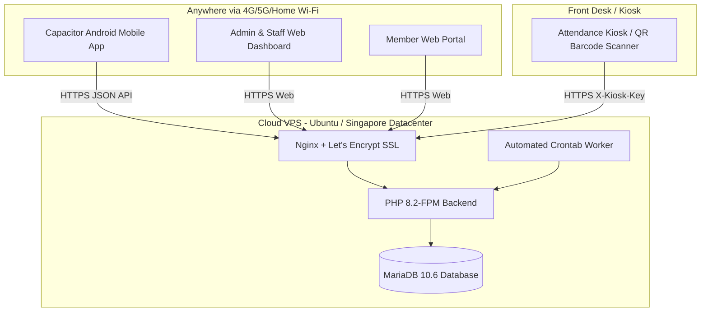

# PALMA'S ELITE GYM — CLOUD VPS DEPLOYMENT & KIOSK INTEGRATION RUNBOOK

This guide walks you through deploying **Palma's Elite Gym Management System** to a high-speed Cloud VPS (DigitalOcean / AWS Lightsail / Linode) with SSL, while connecting your in-gym front desk attendance scanner tablet/PC seamlessly.

---

## 🏗️ Architecture Overview



---

## PART 1: Create Your Cloud VPS

1. **Sign Up for a VPS Provider**:
   * [DigitalOcean](https://www.digitalocean.com/) (Choose *Basic Droplet*, $4–$6/month).
   * Or [AWS Lightsail](https://aws.amazon.com/lightsail/) (Choose $3.50 or $5/month plan).
   * Or [Linode / Akamai](https://www.linode.com/) ($5/month).
2. **Server Specifications**:
   * **OS**: **Ubuntu 22.04 LTS** or **Ubuntu 24.04 LTS**.
   * **Region**: **Singapore** *(Crucial: Provides the fastest 15-30ms ping latency for Philippine gyms and members)*.
   * **Authentication**: Set an SSH Key or strong Root Password.

---

## PART 2: 1-Click Server Provisioning

1. Connect to your VPS via SSH from your computer (Terminal / PowerShell / PuTTY):
   ```bash
   ssh root@YOUR_SERVER_IP
   ```
2. Download and run the automated provisioning script we created:
   ```bash
   curl -sSL https://raw.githubusercontent.com/.../setup-server.sh | bash
   # OR upload setup-server.sh from gym/deploy/setup-server.sh to your server and run:
   chmod +x /var/www/palmas-gym/gym/deploy/setup-server.sh
   /var/www/palmas-gym/gym/deploy/setup-server.sh
   ```

---

## PART 3: Upload the Application & Configure `.env`

1. **Upload Files**: Copy the contents of the `gym/` folder to `/var/www/palmas-gym/gym/` on your server (using SCP, SFTP, FileZilla, or Git):
   ```bash
   # From your local PC terminal:
   scp -r c:\xam\htdocs\gggym\gym\* root@YOUR_SERVER_IP:/var/www/palmas-gym/gym/
   ```

2. **Configure Production Environment**:
   ```bash
   # Copy environment template to outside public webroot
   cp /var/www/palmas-gym/gym/.env.example /var/www/palmas-gym/.env
   
   # Edit secrets:
   nano /var/www/palmas-gym/.env
   ```
   * Set `APP_ENV=production`
   * Set `APP_URL=https://yourgymdomain.com`
   * Set `DB_USER=palmas_gym_user` and `DB_PASS=YOUR_SECURE_PASSWORD`
   * Set `QR_SECRET_KEY` (generate 32 random characters)
   * Set `KIOSK_API_KEY` (e.g. `kiosk_palmas_elite_2026`)
   * Set `SMTP_PASS` (Gmail App Password)

3. **Set Permissions**:
   ```bash
   chown -R www-data:www-data /var/www/palmas-gym
   find /var/www/palmas-gym/gym -type d -exec chmod 755 {} \;
   find /var/www/palmas-gym/gym -type f -exec chmod 644 {} \;
   chmod 600 /var/www/palmas-gym/.env
   chmod 755 /var/www/palmas-gym/gym/uploads/members
   chmod 700 /var/backups/palmas-gym
   ```

---

## PART 4: Setup Database

Run these commands in your SSH terminal:
```bash
mysql -u root -e "CREATE DATABASE IF NOT EXISTS gym_management CHARACTER SET utf8mb4 COLLATE utf8mb4_unicode_ci;"
mysql -u root -e "CREATE USER IF NOT EXISTS 'palmas_gym_user'@'localhost' IDENTIFIED BY 'YOUR_SECURE_PASSWORD';"
mysql -u root -e "GRANT ALL PRIVILEGES ON gym_management.* TO 'palmas_gym_user'@'localhost'; FLUSH PRIVILEGES;"

# Import baseline schema
mysql -u palmas_gym_user -p'YOUR_SECURE_PASSWORD' gym_management < /var/www/palmas-gym/gym/gym_management.sql

# Apply performance indexes and foreign keys
cd /var/www/palmas-gym/gym
php migrate_all_foreign_keys.php
php migrate_database_indexes.php
```

---

## PART 5: Configure Nginx & Free SSL (Certbot)

1. Point your domain (e.g. `gym.yourdomain.com`) to `YOUR_SERVER_IP` in your DNS registrar (Namecheap, GoDaddy, Cloudflare).
2. Configure Nginx:
   ```bash
   cp /var/www/palmas-gym/gym/deploy/nginx/palmas-gym.conf /etc/nginx/sites-available/palmas-gym.conf
   
   # Replace YOUR-DOMAIN.example with your actual domain:
   sed -i 's/YOUR-DOMAIN.example/gym.yourdomain.com/g' /etc/nginx/sites-available/palmas-gym.conf
   
   # Enable site
   ln -s /etc/nginx/sites-available/palmas-gym.conf /etc/nginx/sites-enabled/
   rm -f /etc/nginx/sites-enabled/default
   nginx -t
   systemctl reload nginx
   ```
3. Issue automated Free SSL:
   ```bash
   certbot --nginx -d gym.yourdomain.com
   ```

---

## PART 6: Enable Daily Maintenance & Automated Backups

Install the crontab:
```bash
crontab -e
```
Paste the two lines from `gym/deploy/cron/crontab.txt`:
```cron
5 0 * * * /usr/bin/php /var/www/palmas-gym/gym/cron/daily_maintenance.php >> /var/log/palmas-gym-maintenance.log 2>&1
0 2 * * * /bin/bash /var/www/palmas-gym/gym/deploy/cron/backup-database.sh >> /var/log/palmas-gym-backup.log 2>&1
```

---

## PART 7: Setup the In-Gym Attendance Kiosk

At the front desk of Palma's Elite Gym (on an Android tablet, iPad, or front-desk PC with a 2D QR barcode scanner):

1. Open the browser (Chrome / Edge) on the Kiosk device.
2. Navigate to:
   ```
   https://gym.yourdomain.com/attendance.php
   ```
3. Log in with your staff account or set the kiosk mode in full-screen (F11 / Kiosk browser app).
4. When members walk in and hold up their phone with the dynamic QR pass, the scanner instantly registers their attendance in under 0.2 seconds!

---

## PART 8: Distribute the Android Member Mobile App

1. Update the API URL in the mobile app to point to your new cloud domain:
   * In `gym/mobile-app/www/index.html`, set:
     `let API_URL = "https://gym.yourdomain.com/api";`
2. Run the release build script:
   * Windows: `gym/mobile-app/build-release-apk.bat`
   * Linux/macOS: `gym/mobile-app/build-release-apk.sh`
3. Upload the generated `app-release.apk` to `/var/www/palmas-gym/gym/downloads/palmas-elite-gym.apk`.
4. Members can download it directly from your website at `https://gym.yourdomain.com/download.php` or scan a poster at your front desk!
